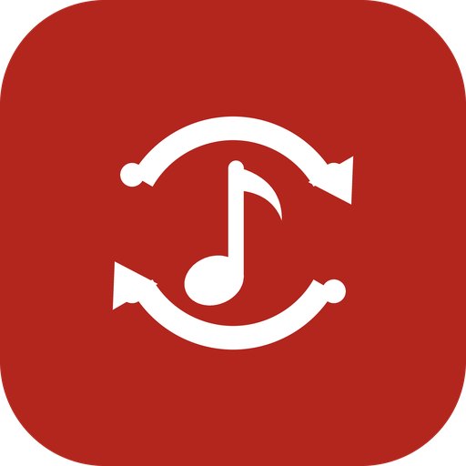

<p align="center">
  
</p>

# Songport Bridge

Optional companion app for [Songport](https://github.com/xlollx/Songport). It connects music services
that have no open API, or whose official route is heavy for a single user, through the same web
interfaces their own players use. Songport discovers this app when installed and offers those
services; it never includes, downloads or installs it.

It is distributed **only here, as an APK**, never on Google Play. The Songport build on Google Play
uses only official APIs and never mentions or links to this app.

| Service | What it adds | Official route in Songport |
|---------|--------------|----------------------------|
| YouTube Music | playlists, liked songs, search, create, add, remove, without a Google Cloud project and without quota | YouTube Data API v3 with your own key (10,000 units/day) |
| Amazon Music | playlists, search, create, add, remove | none: Amazon's Web API is a closed beta for approved partners |
| Spotify | sign-in without registering a developer app | OAuth with your own client ID |
| Apple Music | sign-in without the Apple Developer Program | MusicKit with your own developer token (99 €/year) |

## Read this before installing

- These are **not official APIs**. Using them is against the terms of service of Google/YouTube,
  Amazon, Spotify and Apple, which require access through the interfaces they provide.
- They **can stop working at any time**: the services change their internal responses without notice.
  When that happens, syncs fail until a new Bridge release is published.
- In the worst case a service could **restrict the account** you sign in with. Use accounts you can
  afford to lose, and prefer the official routes for anything important.
- The app shows a disclaimer and asks you to accept it before the first sign-in, and the notice stays
  readable from the main screen.
- Nothing here bypasses authentication or touches anyone else's data: you sign in to your own
  accounts, on the services' own pages, and the app reads and edits your own playlists.
- **Your passwords are never seen or stored.** You type them only on the services' pages inside the
  WebView. What the app keeps is the session (cookies), encrypted with the Android Keystore.

## How each connector works

### YouTube Music

A WebView opens accounts.google.com; when Google lands on music.youtube.com the session cookies are
stored encrypted. Requests go to `youtubei/v1/...` signed with `SAPISIDHASH`, carrying the visitor id
and client version read from the player page so they look like the player's own, which is what keeps
the service from refusing them. Calls are paced (and slowed further after each refusal) because the
web interface throttles bursts of searches. Catalogue searches run **anonymously** (no cookies, an
anonymous visitor id): they do not need the account, and the account's own quota is what a long sync
would otherwise exhaust. Only if the anonymous route is refused does a search fall back to the
signed-in session. Library reads and writes always use the session.

Endpoints: `browse` (playlists, playlist contents, liked songs), `search` with the songs filter,
`playlist/create`, `browse/edit_playlist`, `like/like`, `like/removelike`. Responses are parsed by
looking for known renderer names anywhere in the tree, not by fixed paths, so small layout changes do
not break it.

### Amazon Music

Sign-in happens on the account's regional player (music.amazon.it, music.amazon.de, ...). Requests go
to `<region>.web.skill.music.a2z.com/api/<method>` with the `x-amzn-*` headers derived from the
player's `config.json`, serialised inside the request body. Methods: `showLibraryPlaylists`,
`showLibraryPlaylist` (rows carry the entry id needed to remove a track), `searchCatalogTracks`,
`createPlaylist`, `addTrackToPlaylist`, `removeTrackFromPlaylist`.

They were mapped from traffic recorded with the app's own **Capture traffic** screen, which runs the
real player in a WebView and mirrors its API calls into a local file with cookies and tokens stripped.
The screen stays available for when Amazon changes something: use the player normally, then share the
file in an issue.

### Spotify

The user signs in on accounts.spotify.com. When Songport needs a token, the Bridge loads
open.spotify.com in a hidden WebView and captures the access token the web player itself requests at
start-up (`/api/token`). Letting the real player make that request keeps it working when Spotify
changes the request's anti-abuse parameters. That token is a first-party token the public Web API
accepts; it lasts about an hour and is handed to Songport, which then runs its normal Spotify code.

### Apple Music

The user signs in with their Apple ID on music.apple.com. The Bridge reads Apple's own MusicKit
developer token from the player's JavaScript and the music user token from the `media-user-token`
cookie, and hands both to Songport, which runs its normal Apple Music code.

## Interface to Songport

The Bridge is a *connector plugin*: it declares the intent action
`com.xlollx.songport.action.CONNECTOR` and a `<meta-data>` entry
`com.xlollx.songport.connector.authority` naming its provider, so Songport finds it without knowing
its package name. Songport then calls the `ContentProvider`
(`content://com.xlollx.songport.ytmbridge.provider`) with `ContentResolver.call()`:

| Prefix | Methods |
|--------|---------|
| YouTube Music (no prefix) | `status`, `disconnect`, `playlists`, `playlistInfo`, `tracks` (paged), `search`, `create`, `add`, `remove` |
| `amazon.` | `status`, `disconnect`, `playlists`, `tracks`, `search`, `create`, `add`, `remove` |
| `spotify.` | `status`, `disconnect`, `token` |
| `apple.` | `status`, `disconnect`, `tokens` |

Sign-in screens are started with the actions `…ytmbridge.LOGIN`, `.AMAZON_LOGIN`, `.SPOTIFY_LOGIN`
and `.APPLE_LOGIN`.

## Security model

- The provider is exported, but **every call verifies the caller**: package name
  `com.xlollx.songport` and the SHA-256 of its signing certificate must match the list in
  `BridgeProvider.kt` (`Allowed`). Any other app gets an error and no data.
- Sessions never leave this app. Songport receives playlists and tracks, or short-lived API tokens,
  nothing else.
- There is no server: the phone talks to the services directly.
- Signing out of a service deletes its stored session and its cookies in the WebView; the other
  services stay connected.

A fork that rebuilds Songport with its own signing key must also rebuild the Bridge with that key's
fingerprint in `Allowed.SHA256`, otherwise the two apps will not talk to each other.

## Install

1. Download the latest APK from the [Releases](https://github.com/xlollx/Songport-YTM-Bridge/releases) page.
2. Install it (Android asks to allow installs from your browser or file manager once).
3. Open the Bridge, accept the disclaimer and sign in to the services you want.
4. In Songport: Accounts → **+** → pick the service → give the connector a name → **Connect**.

Updates: install the new APK over the old one. The app is in English, Italian, French and German, with
a language picker on its main screen.

## Building

JDK 17 and an Android SDK with platform 36. From `android/`:

```bash
gradle assembleDebug          # APK in app/build/outputs/apk/debug/
```

GitHub Actions builds every push. With the `UPLOAD_KEYSTORE_BASE64`, `UPLOAD_KEYSTORE_PASSWORD`,
`UPLOAD_KEY_ALIAS` and `UPLOAD_KEY_PASSWORD` secrets it also produces the signed release APK, and a
push to `main` whose `versionName` in `app/build.gradle` has no tag yet creates the tag and publishes
the APK as a GitHub Release. To release, bump `versionCode` and `versionName` and push.

## When it breaks

Open an issue with the Songport diagnostics report ("Share technical details" in Songport's Log tab)
and the Bridge version. For Amazon Music, the Capture traffic screen produces exactly what is needed
to fix a changed method. Parsing lives in `YtmClient.kt` and `AmazonClient.kt`; most fixes are a
renderer name or a field that moved.

## License

GPL-3.0, see [LICENSE](LICENSE). Not affiliated with Google, YouTube, Amazon, Spotify or Apple.
"YouTube", "YouTube Music", "Amazon Music", "Spotify" and "Apple Music" are trademarks of their
respective owners, named here only to describe compatibility.
